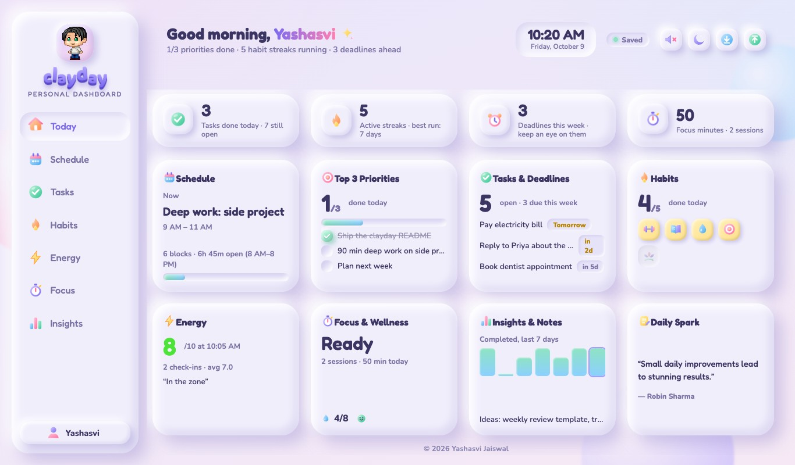
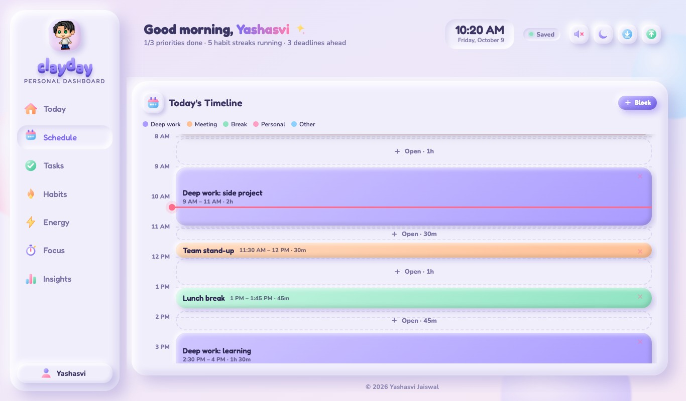
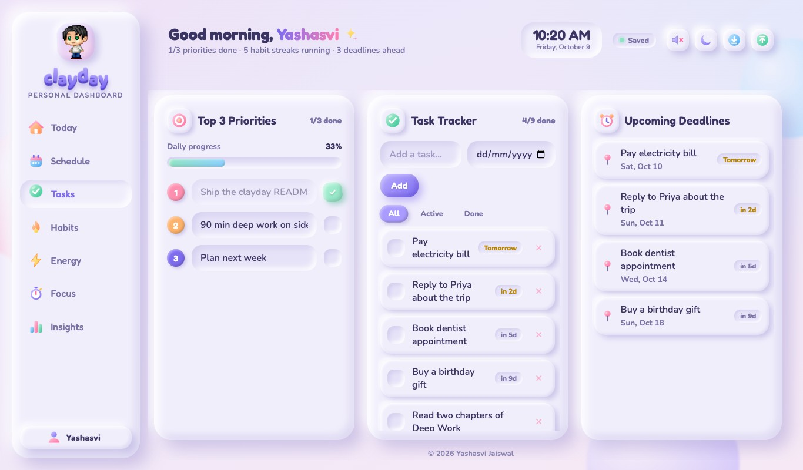
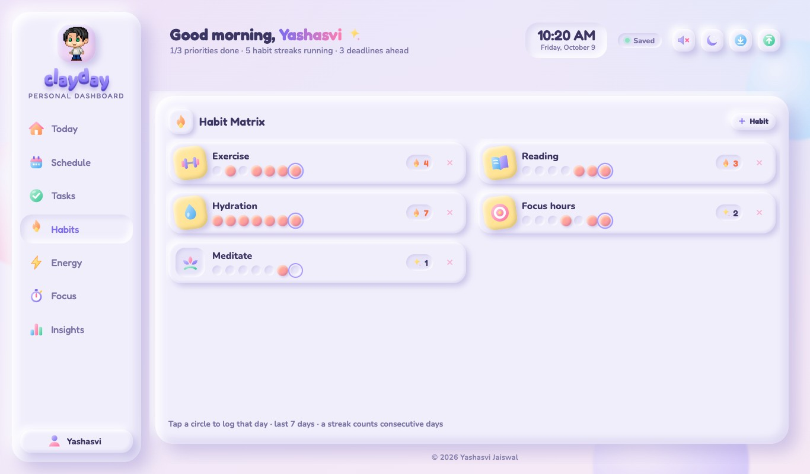
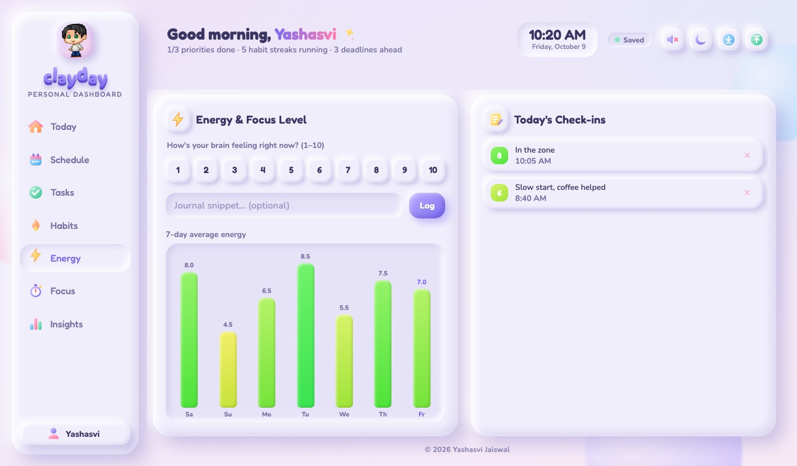
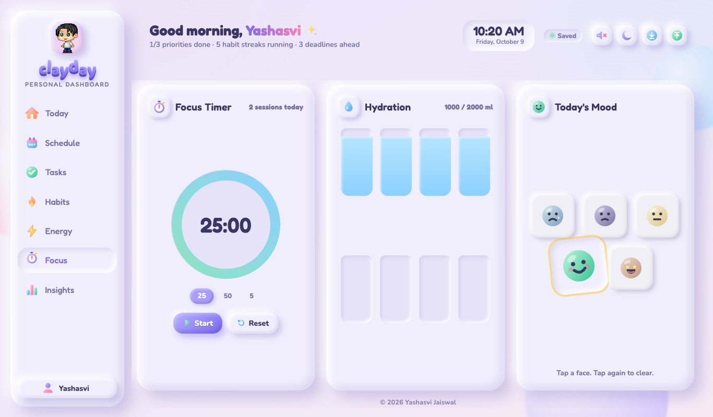
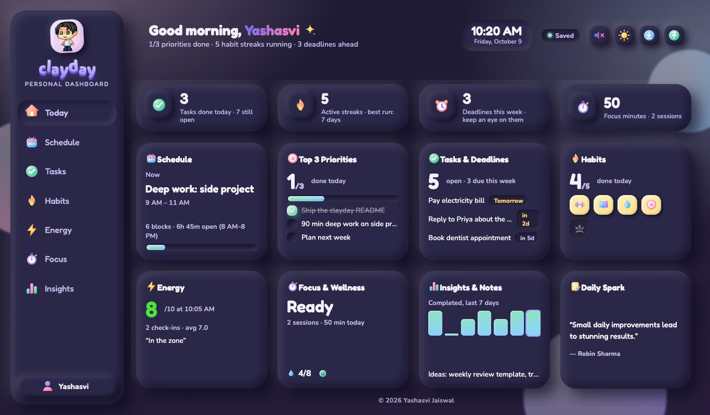
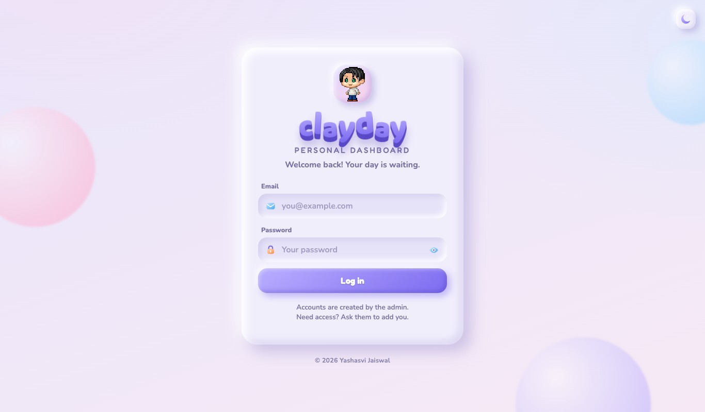
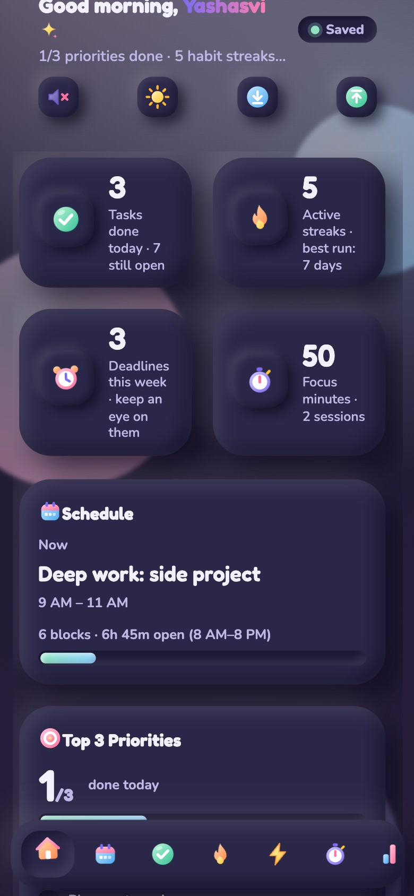

<div align="center">

# clayday · Personal Dashboard

**A soft, squishy day planner made of digital clay.**
Plan your day, track habits, log your energy, and hear a little *bloop* on every click.



</div>

## What's inside

| | |
|---|---|
| **Today** | One-screen home with live tiles for everything below. Nothing to scroll. |
| **Schedule** | Timeline with deep-work blocks, a live "now" line and clickable open slots. |
| **Tasks** | Top 3 priorities with a progress bar, a task list with due dates, upcoming deadlines. |
| **Habits** | Daily toggles with a 7-day streak row. Add your own, pick an icon. |
| **Energy** | 1–10 focus/energy check-ins with a journal line and a 7-day chart. |
| **Focus** | Pomodoro timer (25 / 50 / 5), water tracker, mood picker. |
| **Insights** | Weekly completion chart and quick notes. |

Also: claymorphic UI with smooth animations, synthesized clay-pop sounds (mutable), dark mode, JSON export/import, and a phone layout with a bottom tab bar.

<table>
  <tr>
    <td></td>
    <td></td>
  </tr>
  <tr>
    <td></td>
    <td></td>
  </tr>
  <tr>
    <td></td>
    <td></td>
  </tr>
</table>

<p align="center">
  
  &nbsp;
  
</p>

## How it's built

Plain HTML, CSS and JavaScript (no framework, no build step) on **Cloudflare Pages**, with a Pages Function API and **D1** (SQLite) for storage.

```
public/       the app (index.html, login.html, app.js, clay.css, common.js)
functions/    /api/* — login, per-user data, admin user management
schema.sql    D1 tables
scripts/      create-admin.mjs
```

**Accounts:** there's no public signup. One admin is created from the command line, then adds everyone else from *Account → Manage users*. Passwords are hashed with PBKDF2, sessions use an HttpOnly cookie, and repeated bad logins are rate-limited.

## Run it yourself

```bash
npm install
npm run db:local        # create local tables
npm run admin:local     # create the admin login (asks for a password)
npm run dev             # http://localhost:8788
```

Before the admin command, set your own email in `scripts/create-admin.mjs`.

## Deploy to Cloudflare

```bash
npx wrangler login
npx wrangler d1 create clayday      # paste the printed database_id into wrangler.toml
npm run db:remote                   # create the tables
npm run admin:remote                # create the admin login
npx wrangler pages project create clayday --production-branch main
npm run deploy
```

---

<p align="center">© 2026 Yashasvi Jaiswal</p>
